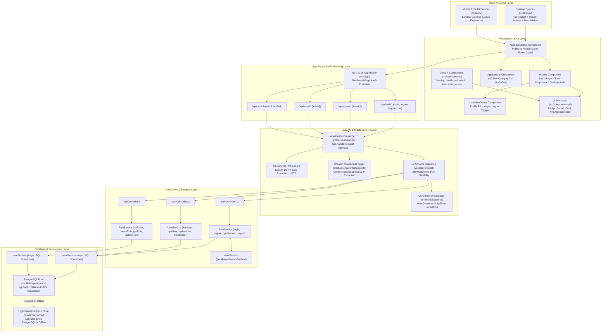
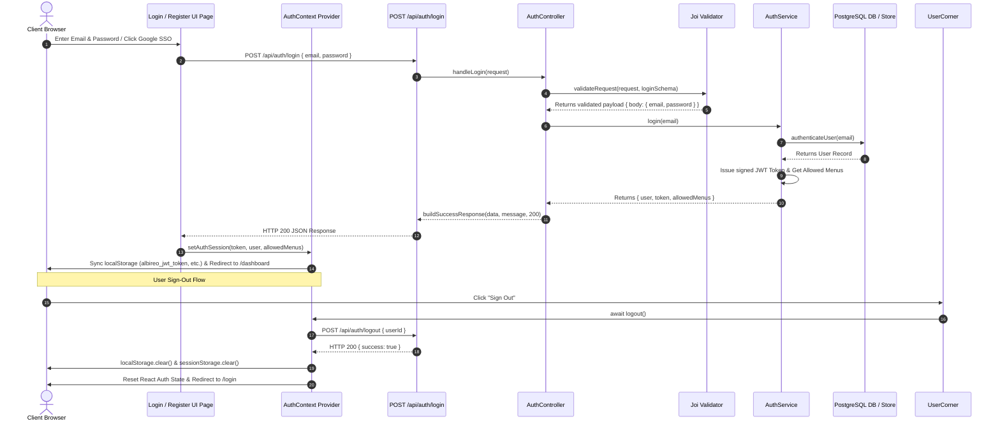

# Albireo - System Architecture & Engineering Blueprint

This document provides a comprehensive technical blueprint and architectural specification for **Albireo** (`A L B I R E O`). It is designed to help engineers, technical leads, and new developers instantly understand the system topology, data flow, component hierarchy, security pipelines, and database architecture.

---

## 1. High-Level System Architecture Diagram

The diagram below illustrates the end-to-end flow from client viewports down to backend services and PostgreSQL persistence.



---

## 2. Authentication & Session Lifecycle Diagram

This diagram details the sign-in, JWT token generation, localStorage sync, and sign-out session purge sequence.



---

## 3. Directory Layout & Module Ownership

```
alberio/
├── ARCHITECTURE.md           # Master System Architecture Specification
├── README.md                 # Project Overview & Execution Guide
├── package.json              # Shared Dependencies & Script Runners
├── src/
│   ├── app/                  # NEXT.JS 16 APP ROUTER
│   │   ├── api/              # Server API Endpoints (auth, users, roles, compliance, risk)
│   │   ├── academy/          # Trader Academy Pages
│   │   ├── admin/            # Executive CEO Command Center Pages
│   │   ├── dashboard/        # Personal Cockpit Dashboard Page
│   │   ├── login/            # Desktop Login Page
│   │   ├── register/         # Desktop Register Page
│   │   ├── terminal/         # ECN Trading Terminal & Live Ticket Page
│   │   └── tools/            # Quantitative Software Suite Pages
│   │
│   ├── backend/              # ENTERPRISE BACKEND ARCHITECTURE
│   │   ├── config/           # Winston Logger (`logger.ts`) & Joi Env Validation (`config.ts`)
│   │   ├── controllers/      # Route Controllers (`authController`, `userController`, `roleController`)
│   │   ├── middlewares/      # `authMiddleware`, `errorMiddleware`, `validate`
│   │   ├── models/           # TypeScript Data Models (`userModel`, `roleModel`)
│   │   ├── routes/           # Central Express-Style Router Registry (`index.ts`, `auth.route.ts`, etc.)
│   │   ├── services/         # Domain Business Logic (`authService`, `userService`, `roleService`, `menuService`)
│   │   └── utils/            # `ApiError`, `catchAsync`, `jwt`, `helpers`
│   │
│   ├── components/           # FRONTEND COMPONENTS BY DOMAIN
│   │   ├── common/           # Common Utilities (`Badge.tsx`, `SectionHeader.tsx`, `StatBox.tsx`)
│   │   ├── layout/           # `AppLayoutShell`, `Header`, `AppSidebar`, `UserNavCorner`
│   │   └── ui/               # Atomic Design System (`Badge`, `Button`, `Card`, `ProUpgradeModal`)
│   │
│   ├── constants/            # CENTRALIZED CONSTANTS REGISTRY
│   │   ├── appConstants.ts   # App config, user roles, risk profiles, subscription tiers
│   │   ├── authConstants.ts  # Storage keys, public routes, status messages
│   │   └── landingContent.ts # Landing page content & feature copy
│   │
│   ├── context/              # React AuthContext Provider & Session Manager
│   ├── data/                 # System Mock Data Fallbacks
│   ├── lib/                  # PostgreSQL Connection Pool (`postgres.ts`) & Store Modules
│   └── types/                # Core TypeScript Type Declarations & Entitlements
```

---

## 4. Architectural Layer Breakdown

### Layer 1: Presentation & UI Layer (`src/components/`)
- **Design System Tokens**: Built with Vanilla CSS, Tailwind CSS v4, and Google Fonts (`Sora` for headers/labels, `JetBrains Mono` for quantitative numbers/code).
- **Atomic UI Components (`src/components/ui/`)**: Reusable primitives (`Badge`, `Button`, `Card`, `GlassCard`, `ProUpgradeModal`) designed under the **Open/Closed Principle (OCP)** to accept variant props (`success`, `warning`, `danger`, `primary`, `neutral`) without modifying underlying code.
- **Layout Management (`src/components/layout/`)**:
  - `AppLayoutShell.tsx`: Intercepts protected routes based on `PUBLIC_ROUTES` constants and renders `AppSidebar` exclusively for signed-in sessions.
  - `Header.tsx`: Provides brand navigation and desktop header actions (`hidden lg:flex`).
  - `AppSidebar.tsx`: Displays category menu items according to user role permissions.
  - `UserNavCorner.tsx`: Manages top-right user pill and async logout execution.

### Layer 2: API & Security Pipeline (`src/backend/`)
- **Central Dispatcher (`app.handleRequest`)**: Encapsulates request processing in `src/backend/app.ts`. Injects Helmet-style HTTP security headers (`nosniff`, `DENY`, `XSS-Protection`, `Strict-Transport-Security`).
- **Winston Structured Logger (`logger.ts`)**: Formats server requests, IP metadata, and operational errors into colored console stdout logs.
- **Joi Payload Validator (`validate.ts`)**: Validates request `body`, `query`, and `params` against Joi schemas with `{ allowUnknown: true }` flexibility.
- **Global Operational Error Boundary (`errorMiddleware.ts`)**: Catches unhandled exceptions, converts them into standard `ApiError` instances, and returns uniform `{ success: false, error: "..." }` HTTP JSON responses.

### Layer 3: Business Logic & Services (`src/backend/services/`)
- **Single Responsibility Controllers & Services**: Controllers (`authController`, `userController`, `roleController`) handle HTTP contracts; services (`authService`, `userService`, `roleService`, `menuService`) handle domain rules.
- **Role-Based Access Control (RBAC)**: `MenuService.getAllowedMenusForRole(userRole)` generates dynamic navigation menus based on role entitlements.

### Layer 4: Data & Persistence Layer (`src/lib/db/`)
- **PostgreSQL Pool (`postgres.ts`)**: Managed connection pool reading `POSTGRES_URL`/`DATABASE_URL` with automatic schema DDL table creation (`users`, `user_entitlements`, `user_sessions`, `activity_logs`, `department_master`).
- **High-Speed Store Fallback**: If PostgreSQL is offline, `userStore.ts` and `roleStore.ts` gracefully fall back to in-memory arrays so the application remains 100% operational without crashing.

---

## 5. Developer How-To Reference

### How to Add a New API Endpoint
1. Create Joi validation schema in `src/backend/validations/<feature>Validation.ts`.
2. Add business logic method in `src/backend/services/<feature>Service.ts`.
3. Add request handler in `src/backend/controllers/<feature>Controller.ts`.
4. Register route in `src/backend/routes/<feature>.route.ts`.
5. Create Next.js route file in `src/app/api/<feature>/route.ts` calling:
   ```ts
   export async function POST(request: Request) {
     return app.handleRequest(request, (req) => featureRoute.handleAction(req));
   }
   ```

### How to Add a New UI Component
1. Create component file in `src/components/ui/MyComponent.tsx`.
2. Use predefined CSS design tokens (`font-sora`, `font-mono`, `#22e600` primary green, glassmorphism cards).
3. Add TSDoc block comments explaining props and usage.

### How to Add New System Constants
1. Add new string/metadata key to `src/constants/appConstants.ts` or `src/constants/authConstants.ts`.
2. Import using `@/constants/appConstants` or `@/constants/authConstants`.

---

## 6. Verification & Quality Commands

```bash
# Type Safety Verification (0 errors expected)
npx tsc --noEmit

# Production Build Compiler (Compiles static & dynamic API routes in ~4 seconds)
npm run build

# Development Server (Runs Unified Full-Stack on http://localhost:3000)
npm run dev
```

---

© 2026 Albireo Financial Technologies Inc. All rights reserved.
