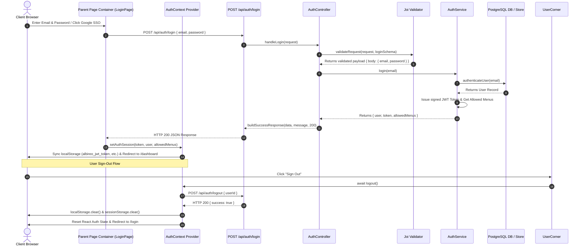

# Albireo - System Architecture & Engineering Blueprint

This document provides a comprehensive technical blueprint and architectural specification for **Albireo** (`A L B I R E O`). It is designed to help engineers, technical leads, and new developers instantly understand the system topology, data flow, component hierarchy, security pipelines, and database architecture.

---

## 1. High-Level System Architecture Diagram

The diagram below illustrates the end-to-end flow from client viewports down to backend services and PostgreSQL persistence.

```mermaid
graph TD
    subgraph Client Viewport Layer
        Desktop["Desktop Devices (>=1024px)<br/>Full Cockpit + Header Actions + Nav Sidebar"]
        Mobile["Mobile & Tablet Devices (<1024px)<br/>Landing Screen Focused Experience"]
    end

    subgraph Presentation & UI Layer (Decomposed Architecture)
        AppShell["AppLayoutShell Component<br/>Public vs Authenticated Route Guard"]
        HeaderComp["Header Component<br/>Brand Logo + Tools Dropdown + Desktop Auth"]
        SidebarComp["AppSidebar Component<br/>Left Nav Category List (Auth Only)"]
        UserCorner["UserNavCorner Component<br/>Profile Pill + Async Logout Trigger"]
        UIPrimitives["UI Primitives (src/components/ui/)<br/>Badge, Button, Card, ProUpgradeModal"]
        ModuleChildComponents["Module Child Components (src/components/modules/)<br/>Auth, UserManagement, RoleManagement, Terminal, Tools, Journal"]
        ParentPageContainers["Parent Page Containers (src/modules/)<br/>LoginPage, RegisterPage, DashboardPage, AdminPages, TerminalPage"]
    end

    subgraph App Router & Route Management Layer
        NextRouter["Next.js 16 App Router (src/app/)<br/>File-Based Page & API Endpoints"]
        RouteRegistry["RouteRegistry (src/routes/RouteRegistry.tsx)<br/>Master Route Array Mapper & Guard Renderer"]
        RoutesConfig["Master Route Array (src/routes/routesConfig.ts)<br/>Route Metadata & Protection Rules"]
        AuthAPI["/api/auth/* (login, logout, register, me)"]
        UserAPI["/api/users/* ([userId])"]
        RoleAPI["/api/roles/* ([roleId])"]
        RiskAPI["/api/compliance & /api/risk"]
    end

    subgraph Security & Middleware Pipeline
        AppDispatcher["Application Dispatcher (src/backend/app.ts)<br/>app.handleRequest Interface"]
        HelmetHeaders["Security HTTP Headers<br/>nosniff, DENY, XSS-Protection, HSTS"]
        WinstonLogger["Winston Structured Logger (src/backend/config/logger.ts)<br/>Console Stdout Stream & IP Extraction"]
        JoiValidator["Joi Schema Validation (validateRequest)<br/>allowUnknown: true Flexibility"]
        ErrorBoundary["Central Error Boundary (errorMiddleware.ts)<br/>errorConverter & ApiError Formatting"]
    end

    subgraph Controllers & Services Layer
        AuthController["authController.ts"]
        UserController["userController.ts"]
        RoleController["roleController.ts"]
        
        AuthService["AuthService (login, register, getSession, logout)"]
        UserService["UserService (listUsers, getUser, updateUser, deleteUser)"]
        RoleService["RoleService (listRoles, createRole, getRole, updateRole)"]
        MenuService["MenuService (getAllowedMenusForRole)"]
    end

    subgraph Database & Persistence Layer
        UserStore["userStore.ts (Async SQL Operations)"]
        RoleStore["roleStore.ts (Async SQL Operations)"]
        PostgresPool["PostgreSQL Pool (src/lib/db/postgres.ts)<br/>pg Pool + Table Auto-DDL Initialization"]
        MemoryFallback["High-Speed Fallback Store (In-Memory Array)<br/>Activates when PostgreSQL is Offline"]
    end

    Desktop --> AppShell
    Mobile --> AppShell
    AppShell --> HeaderComp
    AppShell --> SidebarComp
    HeaderComp --> UserCorner
    HeaderComp --> UIPrimitives

    NextRouter --> RouteRegistry
    RouteRegistry --> RoutesConfig
    RouteRegistry --> ParentPageContainers
    ParentPageContainers --> ModuleChildComponents
    ModuleChildComponents --> UIPrimitives

    NextRouter --> AuthAPI
    NextRouter --> UserAPI
    NextRouter --> RoleAPI
    NextRouter --> RiskAPI

    AuthAPI --> AppDispatcher
    UserAPI --> AppDispatcher
    RoleAPI --> AppDispatcher
    RiskAPI --> AppDispatcher

    AppDispatcher --> HelmetHeaders
    AppDispatcher --> WinstonLogger
    AppDispatcher --> JoiValidator
    JoiValidator --> ErrorBoundary

    JoiValidator --> AuthController
    JoiValidator --> UserController
    JoiValidator --> RoleController

    AuthController --> AuthService
    UserController --> UserService
    RoleController --> RoleService

    AuthService --> MenuService
    AuthService --> UserStore
    UserService --> UserStore
    RoleService --> RoleStore

    UserStore --> PostgresPool
    RoleStore --> PostgresPool
    PostgresPool -.->|Connection Offline| MemoryFallback
```

---

## 2. Authentication & Session Lifecycle Diagram



---

## 3. Directory Layout & Module Component Ownership

```
alberio/
├── ARCHITECTURE.md           # Master System Architecture Specification
├── README.md                 # Project Overview & Execution Guide
├── package.json              # Shared Dependencies & Script Runners
├── src/
│   ├── app/                  # NEXT.JS 16 APP ROUTER
│   │   ├── api/              # Server API Endpoints (auth, users, roles, compliance, risk)
│   │   ├── admin/            # Delegates to RouteRegistry (PATHS.ADMIN.ROOT, USERS, ROLES)
│   │   ├── dashboard/        # Delegates to RouteRegistry (PATHS.DASHBOARD)
│   │   ├── login/            # Delegates to RouteRegistry (PATHS.LOGIN)
│   │   ├── register/         # Delegates to RouteRegistry (PATHS.REGISTER)
│   │   ├── terminal/         # Delegates to RouteRegistry (PATHS.TERMINAL)
│   │   ├── tools/            # Delegates to RouteRegistry (PATHS.TOOLS.ROOT)
│   │   └── journal/          # Delegates to RouteRegistry (PATHS.JOURNAL)
│   │
│   ├── components/           # FRONTEND COMPONENTS BY MODULE
│   │   ├── modules/          # MODULE-SPECIFIC DECOMPOSED CHILD COMPONENTS
│   │   │   ├── Auth/         # LoginForm, RegisterForm, DemoPersonaSwitcher, MobileDesktopNotice
│   │   │   ├── Dashboard/    # UserWelcomeBanner, FunnelRankCard, ConversionBanner
│   │   │   ├── UserManagement/# UserTable, UserHeader
│   │   │   ├── RoleManagement/# RoleCard, RoleHeader
│   │   │   ├── Terminal/     # TerminalHeader, TickerGrid, OrderTicketForm, CandlestickVisualizer
│   │   │   ├── Tools/        # ToolCardGrid
│   │   │   └── Journal/      # CsvUploaderCard, ComplianceReportView
│   │   │
│   │   ├── layout/           # AppLayoutShell, Header, AppSidebar, UserNavCorner
│   │   └── ui/               # Atomic Design System (Badge, Button, Card, GlassCard)
│   │
│   ├── modules/              # PARENT PAGE CONTAINERS
│   │   ├── Auth/             # LoginPage.tsx, RegisterPage.tsx
│   │   ├── Dashboard/        # DashboardPage.tsx
│   │   ├── Admin/            # AdminDashboardPage.tsx, AdminUsersPage.tsx, AdminRolesPage.tsx
│   │   ├── Terminal/         # TerminalPage.tsx
│   │   ├── Tools/            # ToolsSuitePage.tsx
│   │   └── Journal/          # JournalPage.tsx
│   │
│   ├── routes/               # ROUTE MANAGEMENT
│   │   ├── paths.ts          # Centralized route path constants
│   │   ├── routesConfig.ts   # Master route array configuration
│   │   └── RouteRegistry.tsx # Route mapper & guard renderer
```

---

## 4. Architectural Layer Breakdown

### Layer 1: Presentation & Module Component Layer (`src/components/modules/` & `src/modules/`)
- **Parent Page Containers (`src/modules/`)**: Every route maps to a parent page component (`LoginPage.tsx`, `DashboardPage.tsx`, `AdminUsersPage.tsx`, etc.) that composes child components.
- **Decomposed Child Components (`src/components/modules/`)**: Organized by feature domain. Forms, tables, headers, grids, and tickers are separated into dedicated child files.
- **Atomic UI Components (`src/components/ui/`)**: Reusable primitives (`Badge`, `Button`, `Card`, `GlassCard`) designed under the **Open/Closed Principle (OCP)**.

### Layer 2: API & Security Pipeline (`src/backend/`)
- **Central Dispatcher (`app.handleRequest`)**: Encapsulates request processing in `src/backend/app.ts`. Injects Helmet security headers.
- **Winston Structured Logger (`logger.ts`)**: Formats server requests and operational errors into colored console stdout logs.
- **Joi Payload Validator (`validate.ts`)**: Validates request parameters with `{ allowUnknown: true }` flexibility.

---

## 5. Verification Commands

```bash
# Type Safety Verification (0 errors expected)
npx tsc --noEmit

# Production Build Compiler (Compiles static & dynamic API routes in ~3.6 seconds)
npm run build

# Development Server (Runs Unified Full-Stack on http://localhost:3000)
npm run dev
```

---

© 2026 Albireo Financial Technologies Inc. All rights reserved.
